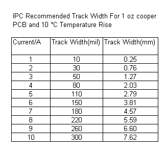
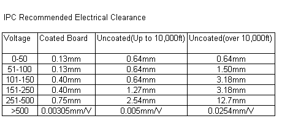

# Table of Contents

- [Table of Contents](#table-of-contents)
  - [Analog circuits](#analog-circuits)
  - [PCBs](#pcbs)
    - [PCB Design Layout Rules Recommendation](#pcb-design-layout-rules-recommendation)
    - [PCB Design Electrical Clearance](#pcb-design-electrical-clearance)
    - [PCBs production](#pcbs-production)
  - [Eagle](#eagle)
    - [Frames](#frames)
    - [How to place next component in multicomponent IC](#how-to-place-next-component-in-multicomponent-ic)
    - [Some tipps for layouting](#some-tipps-for-layouting)
    - [Commands](#commands)
  - [USB](#usb)
  - [Arduino](#arduino)
    - [EEPROM](#eeprom)
    - [Funs](#funs)

## Analog circuits

| Link                                                                                 | Description                                                         |
| ------------------------------------------------------------------------------------ | ------------------------------------------------------------------- |
| [1](http://www.analog.com/library/analogDialogue/archives/41-01/pulse_oximeter.html) | Pulse Oximeter Uses ADuC7024 MicroConverter. Current source with OP |

## PCBs

### PCB Design Layout Rules Recommendation

**Conductor Thickness and Width**
The PCB conductor thickness and width will determine the current carrying capacity of the track. The IPC standard for the conductor thickness and width of the common 1 oz/square-feet PCB is as shown below. However, it is always advisable to use a bigger value due to the tolerance and variation of the PCB processes. If higher current carrying capacity is required, a 2 oz/square-feet or 3 oz/square-feet type of PCB is preferred. Many electronics hobbyist prefer to solder a thick cooper conductor on the PCB track to increase the current carrying capacity of the track

### PCB Design Electrical Clearance

Many safety standards call for a minimum of 8mm clearance between 40V mains and other isolated signal tracks. These safety standards are to ensure that the users that are using the products will be protected from any electrical hazards.

For non main voltages, IPC recommend the electrical clearance between adjacent tracks. It is important to know the maximum difference in voltage that are applied on the adjacent tracks of a PCB. The electrical clearance specs of IPC standard is as shown below for various condition of the PCB.

Coating the PCB will help to reduce the requirements of the track clearance. However, the quality of the coating as well as the material used are critical to ensure that these requirements are met. Again, it is always advisable to increase the clearance to cater for the variations of the PCB processes

### PCBs production

| Link                                                                              | Description                          |
| --------------------------------------------------------------------------------- | ------------------------------------ |
| [1](http://www.pcb-pool.com/)                                                     | Production of PCBs in 8 working days |
| [2](https://www.mikrocontroller.net/articles/Platinenhersteller#Platinendesign)   | PCB productions                      |
| [3](http://www.youtube.com/watch?v=YoVen9os4Sk)                                   | Eagle video tutorial                 |
| [4](http://myhome.spu.edu/bolding/EE4211/EagleTutorial4.htm)                      | Eagle tutorial                       |
| [5](http://we.easyelectronics.ru/RuslanPopov/delaem-pochti-zavodskuyu-platu.html) | Almost production PCB                |

Distributors:
| Link                       | Description                                               |
| -------------------------- | --------------------------------------------------------- |
| [1](http://de.farnell.com) | Farnell. Most expensive, but they have a lot of things    |
| [2](http://digikey.de)     | Digikey. A lot of things with lower price than at farnell |

## Eagle

### Frames

On the menu bar (on the top) select Library >> Use >> frames.lbr Then, select Edit >> Add (or use the button on the tool bar), find the Frames library and select a frame. You can now place it anywhere on the drawing as if it were a component like a resistor.
Make net names visible in schematic

27.08.2012: I wanna make the net names visible. I found that I should use "label" command for this reason. Just type "label" in command line in eagle and select the net

Libraries I searched/used:

| Link    | Description           |
| ------- | --------------------- |
| frame   | Frames for schematics |
| testpad | Test points           |

### How to place next component in multicomponent IC

11.10.2012: I have OP with 4 single OP parts. I placed IC1A, but how to place on other sheet IC1B, IC1C, IC1D and power? For this I had to use "invoke" command. In necessary schematic sheet tipp "invoke IC1" in command line and place needed PART
How to find element on board or on schematic

25.10.2012: I just wanted to find where R1 is placed on board. How? Using "show r1" command.

### Some tipps for layouting

29.10.2012: During layouting I found usefull some tricks:

- at first was necessary to define nyme classes in the schematic editor for definition of the wires width on layout. For this I used "Edit -> Net classes" and defined 2 classes: normal connections with name "signals" with width 12mil and power connections "V +" with width 36mil. On schemati is possible to set the net class in net properties. Further info at [Link](http://blog.jaroslavklima.com/2009/11/automatic-route-drill-width-in-eagle.html)
- then set the DRC settings with given from pcb-pool
- cinfigure autorouting as described at [Link](http://www.rn-wissen.de/index.php/Platinen_doppelseitig_layouten_mit_Eagle)
- start autorouting and after fix manually narrow places
- how to make gerber files from brd described here [Link](http://www.piclist.com/images/www/hobby_elec/e_eagle44.htm) But I didn't do that. I sent brd file to [Link](http://www.pcb-pool.com/)

### Commands

| Command  | Description                            |
| -------- | -------------------------------------- |
| ripup ;  | Erases routed things                   |
| show r29 | Shows R29 in schematic or on the board |

## USB

[Out-of-band signaling (LFPS)](http://xillybus.com/tutorials/usb-ltssm-lfps-power-management)

## Arduino

### EEPROM

[Working with EEPROM](https://www.14core.com/working-on-24c256-eeprom-256kbit-32-kbyte-serial-memory-data-storage-on-i2c-bus/)

### Funs

[Hypercube](https://alexgyver.ru/hypergyver/)
[LED rucksack](https://alexgyver.ru/led-backpack/)

## LED strips

[Link](https://raydiy.de/neopixel-mit-arduino-und-esp32-der-led-streifen-ultra-guide/)
