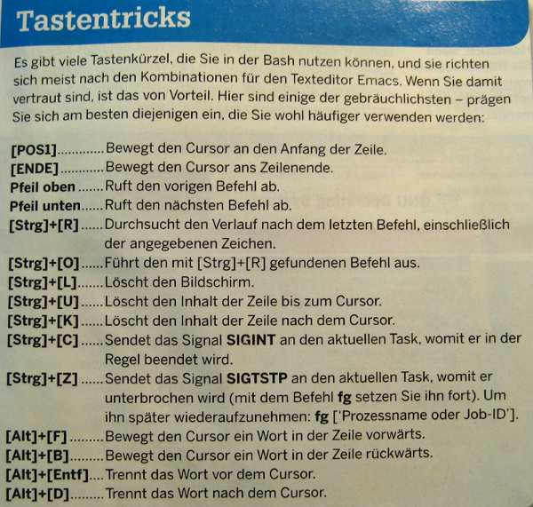

# Table of Contents

- [Table of Contents](#table-of-contents)
  - [Docker](#docker)
  - [Yocto](#yocto)
  - [Console buttons tricks](#console-buttons-tricks)
  - [cryptsetup](#cryptsetup)
  - [Find and delete old kernels](#find-and-delete-old-kernels)
  - [How to measure and monitore CPU temperature](#how-to-measure-and-monitore-cpu-temperature)
  - [Sending of the messages in KDE to desktop notifications](#sending-of-the-messages-in-kde-to-desktop-notifications)
  - [Add an existing user to existing group](#add-an-existing-user-to-existing-group)
  - [How To Create an ISO Image from a CD or DVD](#how-to-create-an-iso-image-from-a-cd-or-dvd)
  - [Running processes in background](#running-processes-in-background)
    - [jobs - Anzeige aktiver Jobs](#jobs---anzeige-aktiver-jobs)
    - [fg - Hintergrundprozess in den Vordergrund holen](#fg---hintergrundprozess-in-den-vordergrund-holen)
    - [bg - Prozess im Hintergrund weiterlaufen lassen](#bg---prozess-im-hintergrund-weiterlaufen-lassen)
  - [Using history](#using-history)
  - [List of network adapters](#list-of-network-adapters)
  - [Bluetooth](#bluetooth)
    - [Ping BT device](#ping-bt-device)
    - [Auto reconnecting of BT connection](#auto-reconnecting-of-bt-connection)
  - [Screenfetch](#screenfetch)
  - [Numbers of CPUs](#numbers-of-cpus)
  - [Get Ubuntu release version](#get-ubuntu-release-version)
  - [Check rootfs at system start](#check-rootfs-at-system-start)
  - [Devilspie](#devilspie)
  - [apt](#apt)
    - [IPv4 for apt update](#ipv4-for-apt-update)
  - [Linux loading average](#linux-loading-average)
  - [avahi](#avahi)
  - [parallel](#parallel)
  - [udev](#udev)
    - [monitor](#monitor)
    - [reload rules](#reload-rules)
  - [lvm](#lvm)
    - [Create PV](#create-pv)
    - [Create VG](#create-vg)
    - [Create LV](#create-lv)
    - [make filesystem](#make-filesystem)
    - [mount filesystem](#mount-filesystem)
  - [mc](#mc)
    - [Go to parent directory with Backspace](#go-to-parent-directory-with-backspace)
  - [tmux](#tmux)
    - [Start/Stop and so on](#startstop-and-so-on)
    - [Most important keys](#most-important-keys)
  - [find \& exec](#find--exec)
  - [fold](#fold)

## [Docker](./Docker.md)

## [Yocto](./Yocto.md)

## Console buttons tricks



## cryptsetup

28.02.2023 setup my stick using of: [Link](https://www.cyberciti.biz/security/howto-linux-hard-disk-encryption-with-luks-cryptsetup-command/)

Example of using for USB stick:

```bash
cryptsetup -y -v --type luks2 luksFormat /dev/sda1
cryptsetup luksOpen /dev/sda1 stick
cryptsetup -v status stick
mkfs.ext4 /dev/mapper/stick
```

```bash
mount /dev/mapper/stick /tmp/1
umount /tmp/1
cryptsetup luksClose stick
```

## Find and delete old kernels

```bash
dpkg --get-selections | grep linux-image
sudo apt-get purge linux-image-5.15.0-91-generic
```

## How to measure and monitore CPU temperature

Use for this purpose install:

```bash
sudo apt-get install lm-sensors
```

Then use:

```bash
sensors
```

For monitore it continuously run

```bash
 watch sensors
```

## Sending of the messages in KDE to desktop notifications

Sometimes could be usefull to send the messages to the desktop. I found for this purpose the "notify-send" programm. U can use it in the following way:

```bash
 notify-send -t 1000 "Hello world!"
```

Or in combination with other SW, for example:

```bash
 while true; do msg=`df`; notify-send -t 1000 "Disk usage $msg"; sleep 10; done
```

## Add an existing user to existing group

Add existing user tony to ftp supplementary/secondary group with usermod command using -a option ~ i.e. add the user to the supplemental group(s). Use only with -G option:

```bash
# usermod -a -G ftp tony
```

## How To Create an ISO Image from a CD or DVD

Use for this

```bash
 cat /dev/sr0 > ~/disk.iso
```

See also [Link](http://www.tech-recipes.com/rx/2769/ubuntu_how_to_create_iso_image_from_cd_dvd/)

## Running processes in background

### jobs - Anzeige aktiver Jobs

Aufruf: jobs [-lnprs] [jobspec ...]

Mit dem Kommando lassen sich alle Hintergrundprozesse ("Jobs") der aktiven bash anzeigen.

Als Optionen versteht jobs:
    -l Zusätzliche Anzeige der PID
    -n Nur Prozesse anzeigen, deren Status sich seit dem letzten Aufruf von jobs geändert hat
    -p Nur die PIDs anzeigen
    -r Nur aktive Prozesse anzeigen
    -s Nur gestoppte Prozesse anzeigen

```bash
user@sonne> sleep 100&
[1] 1177
user@sonne> jobs
[1]+  Running                 sleep 100 &
user@sonne> jobs -n
[1] 1177
```

### fg - Hintergrundprozess in den Vordergrund holen

Aufruf: fg [job_spec]

Ein im Hintergrund laufender Prozess kann in den Vordergrund geholt werden. Soll nicht gerade der zuletzt im Hintergrund gestartet Prozess gewählt werden, ist die Angabe der Jobnummer erforderlich, die man mit dem Kommando jobs ermitteln kann.

```bash
user@sonne> sleep 100& sleep 500&
[1] 1177
[2] 1178
user@sonne> fg %2
```

### bg - Prozess im Hintergrund weiterlaufen lassen

Aufruf: bg [job_spec]

Das Kommando lässt einen zuvor gestoppten Prozess im Hintergrund weiterlaufen. Die Ausführung eines Prozesses wird durch Senden des Signals 19 (SIGSTOP) gestoppt. Befinden sich mehrere Prozesse im Zustand "Stopp", kann mittels %n der gewünschte Prozess über seine Jobnummer angesprochen werden (siehe jobs).

```bash
user@sonne> ls -l > fifo
^z
[1]+  Stopped                 ls --color=tty -l >fifo
user@sonne> bg
[1]+ ls --color=tty -l >fifo &
user@sonne>
```

**Bemerkung**: Die Eingabe von [Ctrl]-[Z] bewirkt in der Bash das Senden des Signals SIGSTOP an den aktiven Prozess.

## Using history

Displays the latest commands that you ran and their number:

```bash
history
```

You can copy and paste command strings. You can recall the latest command:

```bash
!!
```

You can recall a command by its number

```bash
!1003
```

You can recall the latest command matching a starting string:

```bash
!cat
```

## List of network adapters

Stored in /proc/net/dev pseudofile

```bash
cat /proc/net/dev
```

## Bluetooth

### Ping BT device

Using:

```bash
l2ping F0:65:DD:9B:D4:68
```

### Auto reconnecting of BT connection

See [Link](https://www.linux.org.ru/forum/general/10939934?lastmod=1413351281017#comment-10939955)
Use:

```bash
sudo hidd --search
hidd --connect <bdaddr>
```

Check it in:

```bash
/var/lib/bluetooth/bt:ad:dr:es/hidd
```

## Screenfetch

screenFetch is a bash script. It will automatically detect your Linux distribution and will display the logo as ASCII art in a terminal window. Optionally, it can also take a screenshot of your Linux desktop with the aforementioned terminal window displayed. Further information is on [Link](http://tuxtweaks.com/2013/12/install-screenfetch-linux/)

```bash
sudo apt install screenfetch
```

## Numbers of CPUs

Easy way to get it using:

```bash
ncpus
```

Or other way id:

```bash
sh -c 'grep -c processor /proc/cpuinfo'
```

## Get Ubuntu release version

```bash
lsb_release -sr
```

## Check rootfs at system start

```bash
sudo touch /forcefsck
```

## Devilspie

[Wiki](https://wiki.ubuntuusers.de/Devilspie/)

Starting with testing like:

```bash
devilspie --debug
```

Rule to start krusader in fullscreen:

```bash
if 
(is 
	(window_name) "Krusader"
)
	(fullscreen)
)
```

## apt

### IPv4 for apt update

```bash
sudo apt -o Acquire::ForceIPv4=true update
```

**Second possibility**
10.11.2017 I found this one at [Link](https://unix.stackexchange.com/questions/9940/convince-apt-get-not-to-use-ipv6-method)
Add -o Acquire::ForceIPv4=true when running apt-get. If you want to make the setting persistent just create /etc/apt/apt.conf.d/99force-ipv4 and put Acquire::ForceIPv4 "true"; in it:

```bash
 echo 'Acquire::ForceIPv4 "true";' | sudo tee /etc/apt/apt.conf.d/99force-ipv4
```

## Linux loading average

[Link1](https://habr.com/ru/company/vk/blog/335326/) and [Link2](http://www.brendangregg.com/blog/2017-08-08/linux-load-averages.html)

Средние значения нагрузки в Linux — это «средние значения нагрузки системы», показывающие потребность в исполняемых потоках (задачах) в виде усреднённого количества исполняемых и ожидающих потоков

Also useful information is on: [Link](https://en.euro-linux.com/blog/load-average-process-states-on-linux/)

## avahi

```bash
avahi-resolve --name velik-X270.local
avahi-resolve-host-name rasp.alocal
```

## parallel

[Nice manual](https://blog.ronin.cloud/gnu-parallel/)

Using like:

```bash
parallel echo ::: {1..20}
```

## udev

Usually, udevadm requires the sysfs device path of the device in question. But you can also ask udevadm which device path belongs to a certain device node. This gets really helpful if you combine these two queries.

Example: You want to get a list of attributes for a specific device. You do not know the complete device path; all you know is the device node /dev/sdb:

```bash
udevadm info -a -p  $(udevadm info -q path -n /dev/sda)
```

A nice document describing how to use this information to write udev rules can be found on [Link](http://www.reactivated.net/writing_udev_rules.html)

### monitor

```bash
udevadm monitor --environment
udevadm monitor --subsystem-match=usb --property --udev
```

### reload rules

```bash
udevadm control --reload-rules
```

## lvm

[Usefull info](http://www.linuxhaven.de/dlhp/HOWTO/DE-LVM-HOWTO-3.html)

### Create PV

For my Lenovo X220 I used

```bash
pvcreate /dev/sda1
pvcreate /dev/sdb4
```

### Create VG

```bash
vgcreate data_vol /dev/sda1 /dev/sdb4
```

### Create LV

```bash
lvcreate -l 100%FREE -n data_logv data_vol
```

### make filesystem

```bash
mkfs.ext4 /dev/data_vol/data_logv
```

### mount filesystem

```bash
mount /dev/data_vol/data/log_v /mnt/data
```

## mc

### Go to parent directory with Backspace

in /etc/mc/mc.keymap set

```bash
CdParentSmart = backspace
```

## tmux

Tmux is a "terminal multiplexer: it enables a number of terminals (or windows), each running a separate program, to be created, accessed, and controlled from a single screen. tmux may be detached from a screen and continue running in the background, then later reattached."

### Start/Stop and so on

Auflisten aller aktuell laufenden tmux-Sitzungen:

```bash
tmux ls 
```

Neue tmux-Sitzung mit dem Namen "hans" starten:

```bash
tmux new -s hans 
```

Verbinden zur bestehenden Sitzung mit dem Namen "hans":

```bash
tmux attach -t hans 
```

Beendet tmux-Server und -Clients und zerstört alle Sitzungen:

```bash
tmux kill-server
```

### Most important keys

| Keys     | Function                                         |
| -------- | ------------------------------------------------ |
| Ctrl-b c | Create new window                                |
| Ctrl-b d | Detach current client                            |
| Ctrl-b l | Move to previously selected window               |
| Ctrl-b n | Move to the next window                          |
| Ctrl-b p | Move to the previous window                      |
| Ctrl-b & | Kill the current window                          |
| Ctrl-b , | Rename the current window                        |
| Ctrl-b % | Vertical split                                   |
| Ctrl-b " | Horizontal split                                 |
| Ctrl-b q | Show pane numbers (used to switch between panes) |
| Ctrl-b o | Switch to the next pane                          |
| Ctrl-b ? | List all keybindings                             |

## find & exec

Find exec multiple commands syntaxes. There are two syntaxes for find exec.

```bash
find /path [args] -exec [cmd] {} \;
```

- {} Is a placeholder for the result found by find
- \; Says that for each found result, the command cmd is executed once with the found result.
- It is executed like this: cmd result1; cmd result2; …; cmd result N

```bash
find /path [args] -exec [cmd] {} \+
```

- {} Is a placeholder for the result found by find
- \+ Says that for all found results, the command cmd is executed with all the found results.
- It is executed like this: cmd result1 result2 … result N

## fold

Wrap each input line to fit in specified width

```bash
i2ctransfer -yf 6 w1@0x60 0 r128 | fold -w 80
```
