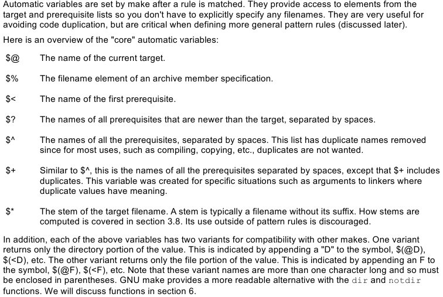

# Table of Contents

- [Table of Contents](#table-of-contents)
  - [make](#make)
    - [Automatic variables](#automatic-variables)
  - [Linker](#linker)
  - [Segments in code](#segments-in-code)

## make

### Automatic variables

Automatic variables used very often in Makefiles. Here I found description of them: [Link](http://www.gnu.org/savannah-checkouts/gnu/make/manual/html_node/Automatic-Variables.html#Automatic-Variables)



## Linker

[Description about linker script language](http://www.math.utah.edu/docs/info/ld_3.html)

## Segments in code

| Segment | Explanation                                 |
| ------- | ------------------------------------------- |
| .bss    | uninitialized data                          |
| .data   | global and static variables are stored here |
| .text   | code                                        |

***.data section***

The .data section contains data definitions of initialized data items. Initialized data is data that has a value before the program begins running. These values are part of the executable file. They are loaded into memory when the executable file is loaded into memory for execution. The important thing to remember about the .data section is that the more initialized data items you define, the larger the executable file will be, and the longer it will take to load it from disk into memory when you run it.

***.bss section***

Not all data items need to have values before the program begins running. When you’re reading data from a disk file, for example, you need to have a place for the data to go after it comes in from disk. Data buffers like that are defined in the .bss section of your program. You set aside some number of bytes for a buffer and give the buffer a name, but you don’t say what values are to be present in the buffer. There’s a crucial difference between data items defined in the .data section and data items defined in the .bss section: data items in the .data section add to the size of your executable file. Data items in the .bss section do not. A buffer that takes up 16,000 bytes (or more, sometimes much more) can be defined in .bss and add almost nothing (about 50 bytes for the description) to the executable file size.

**Explanations**

From [Link](http://stackoverflow.com/questions/9535250/why-is-the-bss-segment-required)

A:

```C
int a[10] = { 1, 2, 3, 4, 5, 6, 7, 8, 9};
int b[20]; /* Uninitialized, so in the .bss and will not occupy space for 20 * sizeof (int) */

int main ()
{
   ;
} 
```

B:

```C
int var[10];  /* Uninitialized so in .bss */

int main ()
{
   var[0] = 20  /* **Initialized, where this 'var' will be ?** */
}
```

The .bss segment is an optimization. The entire .bss segment is described by a single number, probably 4 bytes or 8 bytes, that gives its size in the running process, whereas the .data section is as big as the sum of sizes of the initialized variables. Thus, the .bss makes the executables smaller and quicker to load. Otherwise, the variables could be in the .data segment with explicit initialization to zeroes; the program would be hard-pressed to tell the difference. (In detail, the address of the objects in .bss would probably be different from the address if it was in the .data segment.)

In the first program, a would be in the .data segment and b would be in the .bss segment of the executable. Once the program is loaded, the distinction becomes immaterial. At run time, b occupies 20 * sizeof(int) bytes.

In the second program, var is allocated space and the assignment in main() modifies that space. It so happens that the space for var was described in the .bss segment rather than the .data segment, but that doesn't affect the way the program behaves when running