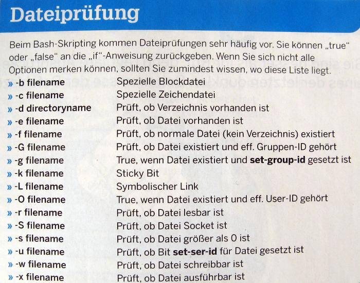

# Table of Contents

- [Table of Contents](#table-of-contents)
  - [Debugging with set](#debugging-with-set)
  - [Strong Quoting with the Single Quotes](#strong-quoting-with-the-single-quotes)
  - [Weak Quotes with the Double Quotes](#weak-quotes-with-the-double-quotes)
  - [bash conditional expressions](#bash-conditional-expressions)
  - [$? and other special parameters](#-and-other-special-parameters)
  - [Return from function](#return-from-function)
  - [switch/case in bash](#switchcase-in-bash)
  - [while-loop is executed in a subbash](#while-loop-is-executed-in-a-subbash)
  - [regexp](#regexp)
  - [Linter](#linter)

---
[PDF Guide for bash programming](./Files/File%20Bash-Beginners-Guide.pdf)

---

## Debugging with set

- set -x - Causes bash to print each command before executing it.
- set -e - Exit immediately if a command exits with a non-zero status. Note that failing commands in a conditional statement will not cause an immediate exit.
- set -o pipefail - Sets the pipeline exit code to zero only if all commands of the pipeline exit successfully.
- set -u - Causes the bash bash to treat unset variables as an error and exit immediately.
- set -E - Improves handling ERR signals

## Strong Quoting with the Single Quotes

When you need to quote several character at once, you could use several backslashes:

```bash
echo a\ \ \ \ \ \ \ b
```

(There are 7 spaces between 'a' and 'b'.) This is ugly but works. It is easier to use pairs of quotation marks to indicate the start and end of the characters to be quoted:

```bash
echo 'a       b'
```

(The HTML ruins the formatting. Imagine that there are 7 spaces between the a and b. -Bruce) Inside the single quotes, you can include almost all meta-characters:

```bash
echo 'What the *heck* is a $ doing here???'
```

What the \*heck\* is a $ doing here???

The above example uses asterisks, dollar signs, and question marks meta-characters. The single quotes should be used when you want the text left alone. If you are using the C shell, the "!" character may need a backslash before it. It depends on the characters next to it. If it is surrounded by spaces, you don't need to use a backslash.

See further information on [Link](http://www.grymoire.com/Unix/Quote.html#toc-uh-1)

## Weak Quotes with the Double Quotes

Sometimes you want a weaker type of quoting: one that doesn't expand meta-characters like "*" or "?," but does expand variables and does command substitution. This can be done with the double quote characters:

```bash
echo "Is your home directory $HOME?"
Is your home directory /home/kreskin/u0/barnett?
```

```bash
echo "Your current directory is `pwd`"
Your current directory is /home/kreskin/u0/barnett
```

Once you learn the difference between single quotes and double quotes, you will have mastered a very useful skill. It's not hard. The single quotes are stronger than the double quotes. Got it? Okay. And the backslash is the strongest of all.

See further information on [Link](http://www.grymoire.com/Unix/Quote.html#toc-uh-2)

## bash conditional expressions



## $? and other special parameters

```bash
- $* bezeichnet alle Positionsparameter von 1 an. In Anfuehrungszeichen gesetzt, steht ``$*'' fuer ein einziges Wort, bestehend aus dem Inhalt aller Positionsparameter, mit dem ersten ``internen Feldseperator'' (meistens Leerzeichen, Tab und Zeilenende) als Trennzeichen.
- $@ bezeichnet alle Positionsparameter von 1 an. In Anfuehrungszeichen gesetzt, wird es durch die Werte der einzelnen Positionsparameter (jeweils ein einzelnes Wort) ersetzt.
- $# Anzahl der Positionsparameter
- $? Rueckgabewert (Status) des zuletzt ausgefuehrten Kommandos
- $- steht fuer die Optionsflags (von set oder aus der Kommandozeile).
- $$ Prozessnummer der bash
- $! Prozessnummer des zuletzt im Hintergrund aufgerufenen Kommandos
- $0 Name des bashscripts
- $_ letztes Argument des zuletzt ausgefuehrten Kommandos
- ${var%/*}  - Removes everything after the last occurrence of / - File path
- ${var##*/} - Removes everything up to the last occurrence of / - File name
- ${var##*.} - File extension
```

## Return from function

```bash
$(...) captures the text sent to stdout by the command contained within. 
return does not output to stdout. $? contains the result code of the last command
```

For getting of result use $?:

fun1 (){
  return 34
}

fun2 (){
  fun1
  local res=$?
  echo $res
}

## switch/case in bash

```bash
#!/bin/bash

eval set -- $(getopt -n $0 -o "-rvxl:" -- "$@")

declare r v x l
declare -a files
while [ $# -gt 0 ] ; do
        case "$1" in
                -r) r=1 ; shift ;;
                -v) v=1 ; shift ;;
                -x) x=1 ; shift ;;
                -l) shift ; l="$1" ; shift ;;
                --) shift ;;
                -*) echo "bad option '$1'" ; exit 1 ;;
                *) files=("${files[@]}" "$1") ; shift ;;
         esac
done

if [ ${#files} -eq 0 ] ; then
        echo output file required
        exit 1
fi

[ ! -z "$r" ] && echo "r on"
[ ! -z "$v" ] && echo "v on"
[ ! -z "$x" ] && echo "x on"
[ ! -z "$l" ] && echo "l == $l"

echo "output file(s): ${files[@]}"
```

## while-loop is executed in a subbash

It tooks some time for me to find why the variable value loosing [Link](https://unix.stackexchange.com/questions/402750/modify-global-variable-in-while-loop)

## regexp

| Link                                           | Description                        |
| ---------------------------------------------- | ---------------------------------- |
| [1](http://www.grymoire.com/Unix/Sed.html)     | Sed - An Introduction and Tutorial |
| [2](http://www.grymoire.com/Unix/Regular.html) | Regular Expressions                |
| [3](http://regex101.com/)                      | Testing of the regular expressions |

## Linter

For checking of script syntax can use this one [Link](https://www.shellcheck.net/) or use:

```bash
apt install shellcheck
```
