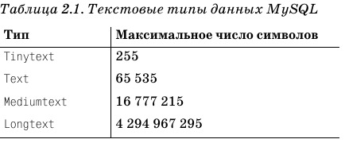
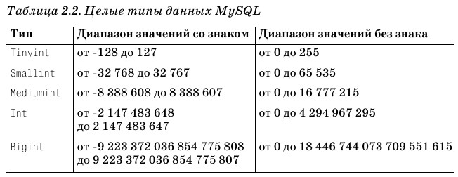
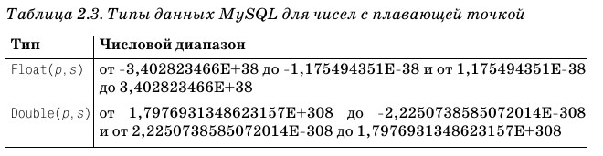
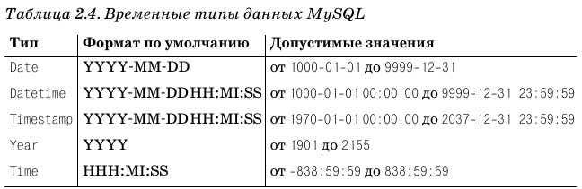

# Table of Contents

- [Table of Contents](#table-of-contents)
  - [Date types](#date-types)
  - [Creating of data bases](#creating-of-data-bases)
  - [Show existing things](#show-existing-things)
  - [Delete existing things](#delete-existing-things)
  - [sqlite](#sqlite)
  
## Date types

- Additional to the following text data exist VARCHAR() datatype. For example Varchar(100)
- Another interesting type is the ENUM(). For example gender ENUM('M','F')









## Creating of data bases

Use command to create database in mySQL:

```sql
CREATE DATABASE test;
```

Switch for using of this DB:

```sql
USE test;
```

And create simple table in it:

```sql
CREATE TABLE test3(id INTEGER, dateTime DATETIME, startCp SMALLINT UNSIGNED NOT NULL DEFAULT 1);
```

## Show existing things

```sql
SHOW DATABASES;
```

```sql
SHOW TABLES;
```

## Delete existing things

```sql
DROP DATABASE test;
```

```sql
DROP TABLE test3;
```

## sqlite

**TODO**